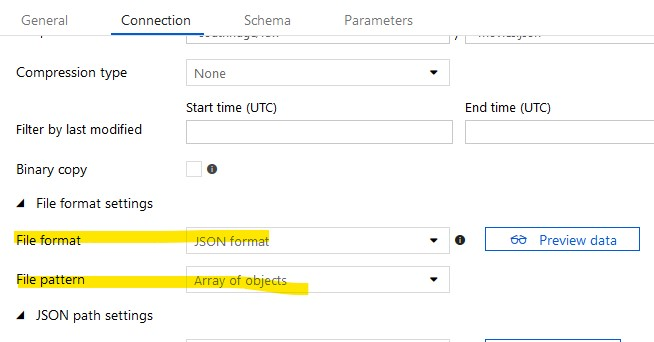

## Challenge 2: Lights, camera, action

The second challenge is to extract the initial Southridge data
from Azure SQL databases and a Cosmos DB collection.
The goal of this challenge is to get the team up and running with a data movement solution.

### Provisioning data movement and orchestration

In the OpenHack, we recommend using Azure Data Factory.

#### Alternative Setups

We strongly advise you to use Azure Data Factory, but there are alternative
options.

- ADF with Data Flow
- SSIS

#### A note on Azure Mapping Data Flows

Teams may want to experiment with Mapping Data Flows for a task or two,
but will likely have a more productive time if they move back to
the standard Azure Data Factory experience.

#### A note on SSIS

One of the great things about OpenHack is that teams can
try new technology without worrying about how it may impact
their primary day to day work. Coaches should encourage teams
to take advantage of this opportunity to dive into modern tooling.

That said, attendees may come in with substantial investments in
SSIS skills and a desire to continue leveraging the existing SSIS packages
in their organization. Coaches can help these attendees understand the idea
of "lifting and shifting" their SSIS packages to run in Azure, and/or
to orchestrate them with Azure Data Factory via the SSIS-IR.
In this way, the skills and legacy packages for data movement and cleansing
can be leveraged, even as the organization moves toward the "bottom up"
mindset of the modern data warehouse.

### Gotchas and Pitfalls

#### Actors in the movie catalog are an array of objects

Teams must use caution when bringing in the catalog from Cosmos.
The actors for each movie are modelled as an array of objects.

##### Option 1 - each line of output is a single JSON object

Choose the JSON format and the Set of objects pattern when defining the sink,
and do not attempt to import schemas.
This will bring the data over with a JSON object on each line of the file.
The file will not be valid JSON, but each line of the file will be a valid JSON object.


When taking this approach, the first two lines of the output file will look like

```json
{"actors":[{"name":"Eric Ray"},{"name":"Danielle Busey"},{"name":"Priscilla Wayne"}],"availabilityDate":"2017-03-14 00:00:00","genre":"Science Fiction","rating":"PG-13","releaseYear":1935,"runtime":162,"streamingAvailabilityDate":"2017-06-06 00:00:00","tier":1,"title":"Happy Theater","id":"9248bacc-4d5c-4758-a250-4002bd645482","_rid":"J4ZPAL+ZaKMBAAAAAAAAAA==","_self":"dbs/J4ZPAA==/colls/J4ZPAL+ZaKM=/docs/J4ZPAL+ZaKMBAAAAAAAAAA==/","_etag":"\"0a0037f2-0000-0100-0000-5ca3aa870000\"","_attachments":"attachments/","_ts":1554229895}
{"actors":[{"name":"Jack Smith"},{"name":"Freida Pine"}],"availabilityDate":"2017-01-31 00:00:00","genre":"Romance","rating":"R","releaseYear":1965,"runtime":100,"streamingAvailabilityDate":"2017-03-28 00:00:00","tier":2,"title":"The Theater of Adventure","id":"10adb54b-ac9c-4a8b-a921-f9bd8ecb3988","_rid":"J4ZPAL+ZaKMCAAAAAAAAAA==","_self":"dbs/J4ZPAA==/colls/J4ZPAL+ZaKM=/docs/J4ZPAL+ZaKMCAAAAAAAAAA==/","_etag":"\"0a0039f2-0000-0100-0000-5ca3aa870000\"","_attachments":"attachments/","_ts":1554229895}
```

##### Option 2 - the file is a JSON array; each line starts with leading syntax

Choose the JSON format and the Array of objects pattern when defining the sink,
and do not attempt to import schemas.



When taking this approach the first two lines of the output file will look like the following.
Note that every line begins with **either a leading bracket, or a leading comma.**
These leading characters can be easily ignored in subsequent processing.
Futhermore, the closing bracket is on its own, separate line at the end of the file,
so it will not disrupt processing of the final object.

```json
[{"actors":[{"name":"Eric Ray"},{"name":"Danielle Busey"},{"name":"Priscilla Wayne"}],"availabilityDate":"2017-03-14 00:00:00","genre":"Science Fiction","rating":"PG-13","releaseYear":1935,"runtime":162,"streamingAvailabilityDate":"2017-06-06 00:00:00","tier":1,"title":"Happy Theater","id":"9248bacc-4d5c-4758-a250-4002bd645482","_rid":"J4ZPAL+ZaKMBAAAAAAAAAA==","_self":"dbs/J4ZPAA==/colls/J4ZPAL+ZaKM=/docs/J4ZPAL+ZaKMBAAAAAAAAAA==/","_etag":"\"0a0037f2-0000-0100-0000-5ca3aa870000\"","_attachments":"attachments/","_ts":1554229895}
,{"actors":[{"name":"Jack Smith"},{"name":"Freida Pine"}],"availabilityDate":"2017-01-31 00:00:00","genre":"Romance","rating":"R","releaseYear":1965,"runtime":100,"streamingAvailabilityDate":"2017-03-28 00:00:00","tier":2,"title":"The Theater of Adventure","id":"10adb54b-ac9c-4a8b-a921-f9bd8ecb3988","_rid":"J4ZPAL+ZaKMCAAAAAAAAAA==","_self":"dbs/J4ZPAA==/colls/J4ZPAL+ZaKM=/docs/J4ZPAL+ZaKMCAAAAAAAAAA==/","_etag":"\"0a0039f2-0000-0100-0000-5ca3aa870000\"","_attachments":"attachments/","_ts":1554229895}

...

,{"actors":[{"name":"Sally Smith"},{"name":"Frank Goodman"}],"availabilityDate":"2017-01-03 00:00:00","genre":"Science Fiction","rating":"PG-13","releaseYear":1999,"runtime":146,"streamingAvailabilityDate":"2017-02-28 00:00:00","tier":2,"title":"The Western Brick","id":"9ec5e5cb-cb62-4ea0-bb37-c0591b5d3d6a","_rid":"J4ZPAL+ZaKMXBAAAAAAAAA==","_self":"dbs/J4ZPAA==/colls/J4ZPAL+ZaKM=/docs/J4ZPAL+ZaKMXBAAAAAAAAA==/","_etag":"\"0a00c3fa-0000-0100-0000-5ca3aae90000\"","_attachments":"attachments/","_ts":1554229993}
]
```

#### Storage Explorer does not support Copy, Cut, Paste, or Move in ADLS Gen2

Teams may find that they want to change their folder structures after running pipelines.
At the time of this writing, Storage Explorer does not support Copy, Cut, Paste, or Move
in ADLS Gen2. Workarounds include:

- Note that the Rename functionality supports relative paths
    - Rename `myfile.txt` to `myfolder/myfile.txt`,
    and `myfile.txt` will move to `myfolder`
    - Rename `myfolder/myfile.txt` to `../myfile.txt`,
    and `myfile.txt` will be moved up to its parent directory
- Alter and re-run the pipeline to use the desired folder structures
- Connect a processing engine like Databricks to mount and move the files
