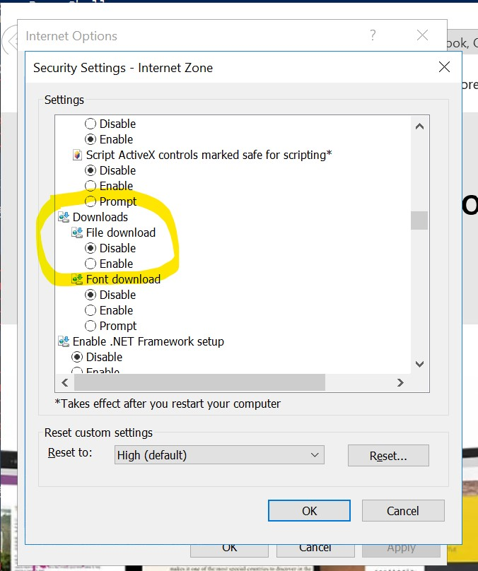
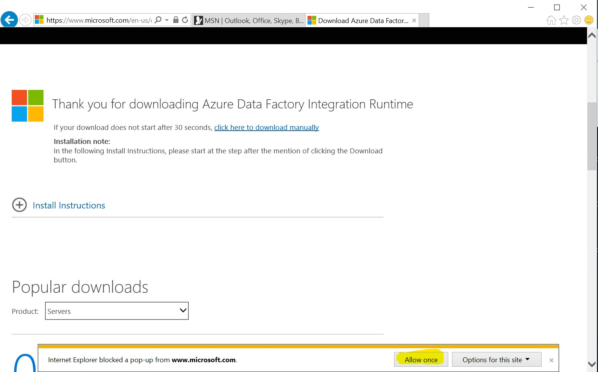
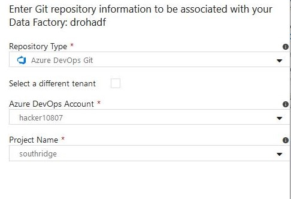
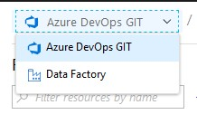

## Challenge 3: Breaking the fourth wall

In this challenge, the team is incorporating additional data sources into their
new data lake. While the initial data was extracted from cloud based Azure SQL
databases, the data from this challenge comes from on-premises data stores.

To establish an OpenHack lab environment, these “on-premises” sources are modelled
as Azure VMs; we ask the attendees to suspend disbelief!

Azure Data Factory supports extraction of on-premises sources
via the installation of a self-hosted integration runtime.

Attentive teams will find that the data from these sources has a variety of data types and formats;
handling this is for the next challenge! For now, keep them focused on *landing the data*.

As far as source control is concerned,
Azure Data Factory supports git integration, or the team can more manually export and commit their work.
If they choose SSIS, the team should still persist the package to source control;
even though there will be little value in “diffs,” maintaining history will still be worthwhile.

For the best experience with ADF's Git integration, teams should defer linking their git repository
until they have completed the creation of their pipelines.

### File downloading blocked on the Virtual Machines

Attendees may struggle to download files from within the Virtual Machines.
To address it, they need to enable file downloads on Internet Explorer.

To do so, on Internet Explorer, go to:

`Tools (Alt+X) > Internet options > Security tab > Select "Internet" zone > Custom level...`

Scroll down to `Downloads` and check `Enabled` for `File download`.

Be aware that the popup blocker may be avoiding the download.
Help them disable it as well:

### Extracting on-premises SQL data

Install the self-hosted integration runtime to extract the data into the
data lake. Note that in true production scenarios, we would not advise
installing the runtime on the SQL Server itself, but would rather use a jump
box. To streamline the OpenHack experience and to save VM costs, we will
allow teams to install the runtime directly on the SQL Server VM.

You can find more about Jumpboxes on the following links:

[Windows N-tier application on Azure with SQL Server - Architecture](https://docs.microsoft.com/en-us/azure/architecture/reference-architectures/n-tier/n-tier-sql-server#architecture)
[Implement a DMZ between Azure and your on-premises datacenter](https://docs.microsoft.com/en-us/azure/architecture/reference-architectures/dmz/secure-vnet-hybrid)
[Jump boxes vs. firewalls](https://www.techrepublic.com/blog/data-center/jump-boxes-vs-firewalls/)

### Extracting on-premises CSV data

Install the self-hosted integration runtime to extract the data into the
data lake. Note that the “happy path” here is to extract the CSV data as-is
and perform any additional transformations in cloud processing. If the team
chooses to extract the data in another format (e.g., parquet), they may need
a hint that the JRE and C++ runtime need to be installed first.

### Establishing source control

In the OpenHack, we recommend using Azure DevOps Repos or GitHub.

### Gotchas and Pitfalls

#### Note the limit of five basic licenses in the Azure DevOps free tier

Teams must note that only five of the provided Azure accounts will get
a full Basic license within Azure DevOps. If all six hacker accounts are used,
then one will have [a more limited "Stakeholder" experience](https://docs.microsoft.com/en-us/azure/devops/organizations/security/access-levels?view=azure-devops).

- It is possible to add unlimited *Stakeholders* to an Azure DevOps project.
This access level has limited access to features on **private projects**
- For Azure DevOps **public projects**, *Stakeholders* have the same access
level as a *Basic* user (contribute - or read/write - on some features)
- For complementary information, read more about
[Azure DevOps Access Levels](https://docs.microsoft.com/en-us/azure/devops/organizations/security/access-levels?view=azure-devops)
and [Add user accounts to an Azure DevOps project](https://docs.microsoft.com/en-us/azure/devops/organizations/public/invite-users-public?view=azure-devops#add-user-accounts-to-a-project)

#### Ensure hacker accounts have signed into Azure DevOps

We have experienced an issue where the dropdown for Azure DevOps accounts
is empty when creating a link to Azure DevOps from Azure Data Factory.

When things are working **correctly**, it will look like this.

If the dropdowns are not populating, have the team member confirm

- With which hacker account are they signed into ADF?
- Has that same hacker account signed into Azure DevOps?
- If another hacker account owns the desired Azure DevOps account,
has that account invited the other one into their Azure DevOps project?

After confirming these things, we have seen the issue of empty dropdowns
resolve itself after leaving and re-entering the blade for linking Git.

#### There are two experiences in Azure Data Factory

Note that users can switch between two experiences within the ADF authoring
experience, and the pipelines and datasets are **not** shared between them!

#### The right moment to establish source control

For the sake of the attendees' experience, try to guide them to establish
source control as the last step of this challenge.

Current known issues on the integration between Azure Data Factory and Git could
cause frustration:

- It is not possible to change the collaboration branch once
the integration is configured.

As the baseline theory is also valid for the source control approach and
learning is the main purpose, it is valid to go through this path.
