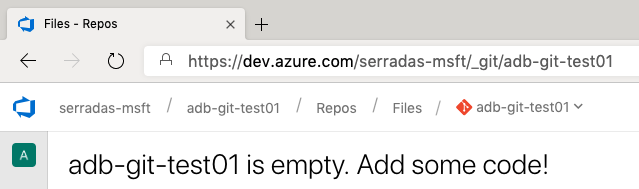

## Challenge 4: More than meets the eye

In this challenge, the team will find (if they have not already!)
that the data from these sources has a variety of data types and formats;
it is up to them to preprocess it to be consistent for downstream consumers.

### Processing the data

In this OpenHack, we recommend using Azure Databricks.

The goal is to transform the heterogenous data into homogenous datasets; i.e.,

- Downstream consumers have a "one-stop shop" for the data,
no matter how many source systems are fed into the lake today (or tomorrow)
- Downstream consumers can trust that data types within the datasets are consistent
- Each record in this new dataset has a marker for which source system the raw data had come from
- The raw data is left as-is

The team could end up with a new folder in their data lake called something like `conformed`.
In here, they might have these five datasets:

1. catalog: all movies from all systems
1. customers: all customers and addresses from all systems
1. sales: all orders and order details; currently only Southridge's CloudSales contributes
1. streaming: all streaming transactions; currently only Southridge's CloudStreaming contributes
1. rentals: all rental transactions; currently both Fourth Coffee and VanArsdel, Ltd. contribute

#### Example target output for the catalog

```text
SourceSystemId:              Use the SourceSystemId we added in the previous cell.
CatalogId:                   Use a new unique identifier.
SourceSystemMovieId:         From Southridge, use the source id. From the others, use the source MovieId.
SouthridgeMovieId:           From Southridge, use the source id. From the others, use the source OnlineMovieId.
ActorID:                     From Southridge, this is null. From the others, it's the source ActorId.
ActorName:                   From Southridge, it's the exploded actor name. From the others, it is the ActorName.
ActorGender:                 Southridge does not track this data. The on premises stores have Gender.
Title:                       From Southridge, use title. From others, MovieTitle.
Genre:                       From Southridge, use genre. From others, Category.
Rating:                      Southridge has rating and the others have Rating.
RuntimeMinutes:              Southridge has runtime, the others have RunTimeMin.
TheatricalReleaseYear:       Southridge has releaseYear. The others don't have this data.
PhysicalAvailabilityDate:    Southridge has availabilityDate. The others have ReleaseDate.
StreamingAvailabilityDate:   Southridge has streamingAvailabilityDate. The others have no such data, as it does not apply to physical rentals.
```

#### Example work breakdown

Several teams have expressed that the challenge becomes too much, too overwhelming, or too repetitive.
If your team is getting frustrated, please advise the following work breakdown.

1. Make sure that the team has seen the example data catalog, and that they have decided on their desired target outputs.
The most successful teams spend 15-30 minutes to load the input data, determine what exists in each source,
and draw a diagram of what they want to conform where. Using the provided data catalog's mapping directly is a viable shortcut.
1. Have the team work together to “swarm” on mounting storage – this becomes common, shared knowledge that benefits all following tasks.
1. Have them work together to “swarm” on the CloudStreaming data – this is the most trivial exercise of the challenge,
“read source data, add a literal value column and a new uuid column, then write that". It sets a baseline understanding for implementing the remaining items.
1. Clone (4x) the notebook created for CloudStreaming; rename them to indicate Sales, Rentals, Customers, and Catalog.
These notebooks now have the “read, add columns, write” skeletons which set the stage for the more interesting work.
1. Parallelize the work to fill in the remaining details between the reading and writing in these four notebooks,
encouraging Catalog to be done last and/or by the most experienced member.

#### To join, cleanse, drop duplicates, etc. ... or not

At this stage, we want to focus on the fatal anomalies that would cause exceptions in downstream processing; e.g., inconsistent data types or formats.
If we were loading this data directly into a final reporting schema, we would likely apply additional cleansing including, but not limited to:

- Look for and eliminate typos, e.g., PGg instead of PG
- Normalize capitalization of titles, names, ratings, etc.
- Look for and resolve conflicts in matched movies, e.g., Southridge thinks Mysterious Cube is a G-rated family movie while VanArsdel, Ltd. had it as a PG-13 rated Comedy
- Look for variations in actor names and choose one to use consistently throughout the reporting schema, e.g., Vivica A. Fox vs Vivica Fox
- Drop duplicates

However, if we perform these operations now, then we may eliminate the opportunity to discover previously unrecognized value in the data.
As a contrived example, consider a possibility that some actors and actresses would occasionally use their middle initial, but sometimes would not.
Now, imagine that data scientists uncover a trend where films are more marketable when the cast does use their middle initial versus when they do not.
Or maybe that only holds true in the Drama genre, but it does not hold in Family movies.
If we have already chosen the person's "usual" billing and only kept that version in our conformed dataset,
then the data scientists would never be able to see this.

### Alternative Approaches

- SSIS
- Land the data into the data lake, and use Azure Synapse Analytics (formerly Azure SQL Data Warehouse) connected to data lake as
external tables to process the data using T-SQL

### Additional reference links

Once the team has chosen a path, they may require more targeted references
which apply to that path. These have not been placed in the challenge text,
as providing links to every possible path creates an overwhelming set.

#### Azure Data Factory

- [Branching and chaining activities in a Data Factory Pipeline](https://docs.microsoft.com/en-us/azure/data-factory/tutorial-control-flow-portal)
- [Run a Databricks notebook with the Databricks Notebook Activity in Azure Data Factory](https://docs.microsoft.com/en-us/azure/data-factory/transform-data-using-databricks-notebook)

#### Azure Databricks

- [Tutorial: Access Data Lake Storage Gen2 data with Azure Databricks using Spark](https://docs.microsoft.com/en-us/azure/storage/blobs/data-lake-storage-use-databricks-spark)
- [Accessing Azure Data Lake Storage Gen1 from Databricks](https://docs.databricks.com/spark/latest/data-sources/azure/azure-datalake.html)
- [Tutorial: Extract, transform, and load data using Azure Databricks](https://docs.microsoft.com/en-us/azure/azure-databricks/databricks-extract-load-sql-data-warehouse)
- [Azure Databricks Version Control](https://docs.azuredatabricks.net/user-guide/notebooks/notebook-use.html#version-control)

#### Syntax References

- [OpenHack Samples](https://ohmdwstor.blob.core.windows.net/teamresources/OpenHack%20Samples.dbc),
which will need to be [imported into the Databricks workspace](https://docs.databricks.com/user-guide/notebooks/notebook-manage.html#import-a-notebook)
- [Databricks Example Notebooks](https://databricks.com/resources/type/example-notebook)
- [Analyze Games from European Soccer Leagues with Apache Spark and Databricks](https://databricks.com/blog/2018/07/09/analyze-games-from-european-soccer-leagues-with-apache-spark-and-databricks.html)
- [iot-data-openhack-helpers](https://github.com/dmakogon/iot-data-openhack-helpers)
- [Spark SQL](https://docs.azuredatabricks.net/spark/latest/spark-sql/index.html).

#### Azure Synapse Analytics (formerly Azure SQL Data Warehouse)

- [Loading data into Azure Synapse Analytics (formerly Azure SQL Data Warehouse) staging tables using Polybase](https://docs.microsoft.com/en-us/azure/sql-data-warehouse/design-elt-data-loading#4-load-the-data-into-sql-data-warehouse-staging-tables-using-polybase)
- [Tutorial: Load New York Taxicab data to Azure Synapse Analytics (formerly Azure SQL Data Warehouse)](https://docs.microsoft.com/en-us/azure/sql-data-warehouse/load-data-from-azure-blob-storage-using-polybase)
- [Load data into Azure Synapse Analytics (formerly Azure SQL Data Warehouse) by using Azure Data Factory](https://docs.microsoft.com/en-us/azure/data-factory/load-azure-sql-data-warehouse)

### Source Control guidance for this challenge

Before getting into branch policies, be aware that the team may experience
issues when configuring Git integration on Databricks.

#### Shortened default repo URLs

Databricks does not support the shortened URL format when using the default
repo for a Team Project. The team needs to provide the full repo URL:

Example of a shortened URL:

`https://dev.azure.com/serradas-msft/_git/adb-git-test01`

Where:

- **serradas-msft** is the Organization
- **adb-git-test01** is the default repo for the *adb-git-test01* Team Project

To make it work, the team needs to add the full URL, like this:

`https://dev.azure.com/serradas-msft/adb-git-test01/_git/adb-git-test01`

Where:

- **serradas-msft** is the Organization
- The **first adb-git-test01** is the Team Project
- The **second adb-git-test01** is the repo

#### The repo must be initialized

It's not likely to happen because the team is supposed to already have
ADF resources into source control. For any reason, if the team is going to
use a different/empty repo:



Be aware that Databricks will not be able to commit it to Git. The recommendation here is to initialize it with a README file through the AzDO portal.

#### Enforcing branch policies

> The team will add a branch policy such that new or updated code must obtain
> at least one approval before being merged to the mainline branch.

<https://docs.microsoft.com/en-us/azure/devops/repos/git/branch-policies?view=vsts>

<https://help.github.com/articles/enabling-required-reviews-for-pull-requests/>

### Important: Roleplay to address Service Principals creation

Teams who wish to use Databricks with Python or SQL can leverage
[identity pass-through](https://docs.azuredatabricks.net/spark/latest/data-sources/azure/adls-passthrough.html#accessing-adls-automatically-with-your-aad-credentials)
to access their data in ADLS without any additional auth configuration.

For teams using Scala in Databricks, identity pass-through is not available,
and they will need to use a service principal.

To streamline the Service Principal creation - which is **not** a learning
objective of this OpenHack - we recommend the coach to roleplay as the *AAD
Admin* of the team's organization.

To do so, we recommend following two docs, depending on the coach's device
and/or command-line preference:

- [Create an Azure service principal with Azure PowerShell](https://docs.microsoft.com/en-us/powershell/azure/create-azure-service-principal-azureps) for Windows or
- [Create an Azure service principal with Azure CLI](https://docs.microsoft.com/en-us/cli/azure/create-an-azure-service-principal-azure-cli?view=azure-cli-latest) for Windows, Mac or Linux or
- [Create an Azure service principal with Azure Portal](https://docs.microsoft.com/en-us/azure/active-directory/develop/howto-create-service-principal-portal) for Windows, Mac or Linux

#### Assigning the right RBAC role for the Service Principal on the Storage Account

After creating the service principal, you also need to give it **Storage Blog
Data Contributor** permission to the Storage Account. To do so, you can follow the steps below:

- In the Azure Portal, navigate to the storage account
- Select **Access Control (IAM)** to display the access control settings for
the storage account. Select the **Role assignments** tab to see the
list of role assignments
- In the **Add role assignment** window, select the **Storage Blob Data Contributor** role
- From the **Assign access to** field, select **Azure AD user, group, or service principal
- Search to locate the service principal to which you want to assign the role
- Save the role assignment

More detailed information can be found on
[this doc](https://docs.microsoft.com/en-us/azure/storage/common/storage-auth-aad-rbac-portal#assign-a-built-in-rbac-role).
Be careful, the same step by step provided above is provided on this doc as
well, but assigning a **Reader** role. Be sure to assign the **Storage Blob
Data Contributor** role.

Make sure to walk the team through the process and, by the end, give them the `tenant id`, `subscription id`, `client id` and `client secret`, ideally stored on an Azure Key Vault.

There are some services that use different naming for these properties. You can
leverage on the matrix below to clarify it to the table.

|Property Name (Service Principal)|Property Name (Databricks)|
|-------------|------------------------------|
|`tenant id`|`directory id`|
|`client id`|`application id`|
|`client secret`|`application key`|

The team already has a useful reference on this challenge reference list to
configure it, which is
[Create a file system in the Azure Data Lake Storage Gen2 account](https://docs.microsoft.com/en-us/azure/azure-databricks/databricks-extract-load-sql-data-warehouse#create-a-file-system-in-the-azure-data-lake-storage-gen2-account)
from the tutorial
[Extract, transform, and load data by using Azure Databricks](https://docs.microsoft.com/en-us/azure/azure-databricks/databricks-extract-load-sql-data-warehouse)

### Additional notes

#### Data Catalog

An [intentionally incomplete data catalog](https://ohmdwstor.blob.core.windows.net/teamresources/DataCatalog.xlsx) has been provided.

Coaches should take note that the Fourth Coffee data aligns very closely
to the VanArsdel, Ltd. data. The mappings and transformations identified for
the VanArsdel, Ltd. data should serve as a fair inspiration for what to do
with Fourth Coffee.

If the team does not have an application with which they can view the xlsx workbook,
each sheet is independently available as a csv file:

- [BusinessModel](https://ohmdwstor.blob.core.windows.net/teamresources/DataCatalog_BusinessModel.csv)
- [Catalog](https://ohmdwstor.blob.core.windows.net/teamresources/DataCatalog_Catalog.csv)
- [Customers](https://ohmdwstor.blob.core.windows.net/teamresources/DataCatalog_Customers.csv)
- [Rentals](https://ohmdwstor.blob.core.windows.net/teamresources/DataCatalog_Rentals.csv)
- [Sales](https://ohmdwstor.blob.core.windows.net/teamresources/DataCatalog_Sales.csv)
- [Streaming](https://ohmdwstor.blob.core.windows.net/teamresources/DataCatalog_Streaming.csv)

#### Gotchas on Databricks

##### Movies catalog from Cosmos DB as multi-line JSON

The team may run into issues when ingesting the movie catalog from
the Cosmos DB. It can be related to the fact that the team is exporting the
data as a multi-line JSON (as a huge array).

If you see the team is facing it, the trick to unblock them is to set the
`multiLine` option to `true` when using `spark.read`.

```python
spark.read
    .option("multiLine", "true")
    .json("/path/to.json")
```

For detailed information, use [this reference](https://spark.apache.org/docs/2.2.1/sql-programming-guide.html#json-datasets).

##### Using widgets to consume parameters on Databricks

If the team struggles to use and consume parameters on a Databricks
notebook, you can share [this reference](https://docs.microsoft.com/en-us/azure/data-factory/transform-data-using-databricks-notebook) with them, highlighting
the section that explains how to use `widgets` to consume parameters
inside a notebook.

Once the page is opened, search for "`Creating widgets for leveraging parameters`"

```python
dbutils.widgets.text("input", "","")
dbutils.widgets.get("input")
y = getArgument("input")
print "Param -\'input':"
print y
```

Make sure the attendees do not get confused by trying to consume a Databricks
notebook from Azure Data Factory to solve this challenge. For upcoming
challenges, they may want to execute a Notebook from ADF when they
establish a daily incremental load on a schedule, later on challenge 6.
