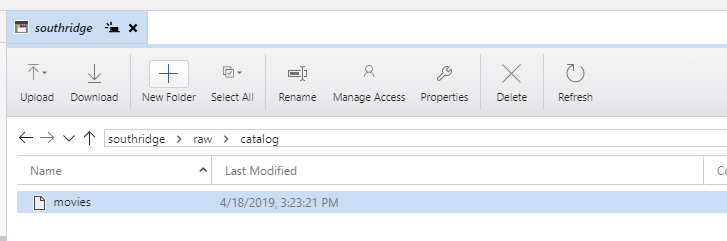

## Challenge 1: Based on a true story

The first challenge is designed to establish an enterprise data lake.
The goal of this challenge is to get the team to choose and provision their storage.
The recommended solution is to provision an Azure Storage account
with the hierarchical namespace enabled,
i.e., [ADLS Gen 2](https://docs.microsoft.com/en-us/azure/storage/blobs/data-lake-storage-introduction).

> Azure Data Lake Storage Gen2 is a set of capabilities dedicated to big data analytics,
built on Azure Blob storage.
Data Lake Storage Gen2 is the result of converging the capabilities
of our two existing storage services,
Azure Blob storage and Azure Data Lake Storage Gen1.
Features from Azure Data Lake Storage Gen1,
such as file system semantics, directory, and file level security and scale
are combined with low-cost, tiered storage,
high availability/disaster recovery capabilities from Azure Blob storage.

### Creating an ADLS Gen 2 Storage Account

The quickstart in the product documentation to
[Create an Azure Data Lake Storage Gen2 storage account](https://docs.microsoft.com/en-us/azure/storage/blobs/data-lake-storage-quickstart-create-account)
has all of the details for creating the storage account
via the Azure portal, PowerShell, or Azure CLI.

Take care to ensure that the storage account kind is StorageV2,
and that the hierarchical namespace is enabled!

### Storing any file

One way to accomplish this is to use [Azure Storage Explorer](https://azure.microsoft.com/en-us/features/storage-explorer/).
Files can be uploaded and downloaded, and the
"Manage Access" feature would support specification
of ACLs on the file.

