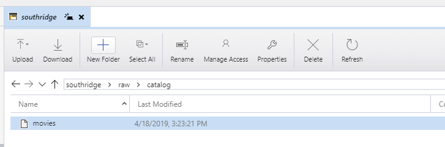
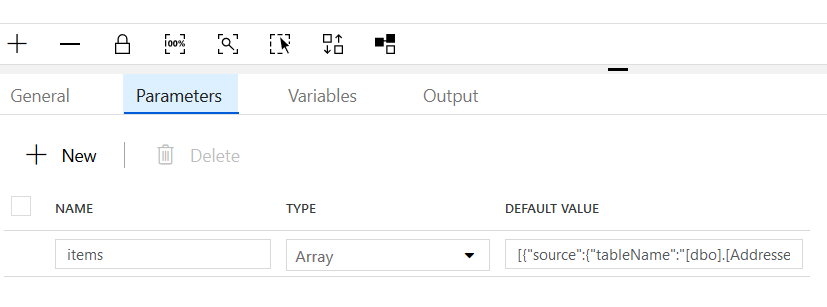
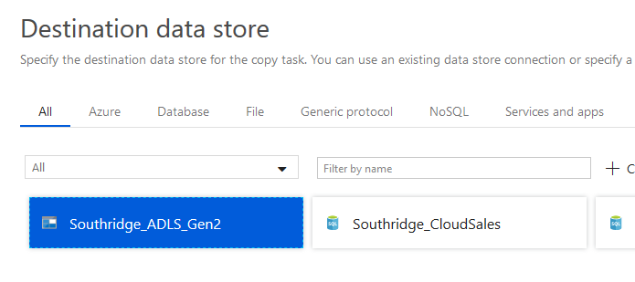

## Challenge 2: Lights, camera, action

The second challenge is to extract the initial Southridge data
from Azure SQL databases and a Cosmos DB collection.
The goal of this challenge is to get the team up and running
with a data movement solution. The recommended solution is to use
[Azure Data Factory](https://docs.microsoft.com/en-us/azure/data-factory/)
to copy data from the source systems into the data lake **as is**,
that is, with **the least possible amount of transformation, cleansing, or processing**.

> NOTE: Even in this challenge, we can already begin to see
the advantages of centralizing the data into an enterprise data lake.
While all of the data in this challenge is in Azure,
there is a mix of relational data in Azure SQL
and non-relational data stored as JSON in a Cosmos DB document collection.

### Creating an Azure Data Factory

The [quickstarts](https://docs.microsoft.com/en-us/azure/data-factory/#5-minute-quickstarts)
in the [product documentation](https://docs.microsoft.com/en-us/azure/data-factory/)
have all of the details for creating the Azure Data Factory resource
via the [Azure portal](https://docs.microsoft.com/en-us/azure/data-factory/quickstart-create-data-factory-portal#create-a-data-factory)
or [PowerShell](https://docs.microsoft.com/en-us/azure/data-factory/quickstart-create-data-factory-powershell#create-a-data-factory).

> NOTE: The quickstarts linked above contain additional information for creating
pipelines within the Data Factory. For the scope of this section of the OpenHack
solution, refer only to the "Create a data factory" section of the quickstart.

### Extracting the sales, streaming, and catalog data into the data lake

At a high level, the steps required are

1. Define linked services and source datasets for the Azure SQL databases
1. Define a linked service and source dataset for the Cosmos DB collection
1. Define a linked service and sink datasets for the ADLS Gen 2 storage account
1. Create pipelines which copy data from the sources to the sinks

#### Defining the Cosmos DB linked service and source dataset

From the Data Factory authoring experience, add a new dataset.


Choose the Azure Cosmos DB (SQL API) Data Store, and then Continue.


From the Connection tab of the dataset properties window, click New
to create a new Linked Service.


The simplest path forward is to select the Cosmos DB account and database from
the provided dropdowns, and then click Finish.


Select the movies collection. It is **not necessary** to preview the data
or to import a schema on the Schema tab.
In fact, the solution will be easier if these elements are ignored,
instead bringing the catalog data into the data lake **as-is**.


You may optionally validate and publish at this time to create a "checkpoint"
of progress, but note that the dataset is not yet being used anywhere.

#### Defining the Azure SQL linked services and source datasets

From the Data Factory authoring experience, add a new dataset.


Choose Azure SQL Database, and then Continue.


On the Connection tab, click "New" to create a new Linked service.
The simplest path forward is to use the dropdowns to select
the target Azure resource. Also supply the authentication credentials,
and then click "Finish".


Rather than hardcode a table name, it would be advantageous to parameterize that
for reuse. Visit the Parameters tab and click "New" to add a tablename parameter.


The parameter can then be used to add dynamic content on the Connection tab.

> NOTE: This screenshot shows the location and styling of the "Add dynamic content"
option, but in the context of a file path. The same concept applies for the "Table"
property of the Azure SQL dataset connection.
Also note that the "Add dynamic content" option may not appear unless the "Edit"
button below the "Table" property has been clicked to turn the dropdown into
a textbox.


> NOTE: Repeat this process to define a dataset for the other Southridge Azure SQL
database. The two databases in the logical server are CloudSales and CloudStreaming.

You may then optionally validate and publish all as a "checkpoint" of progress.

#### Defining the ADLS Gen 2 linked service and sink datasets

From the Data Factory authoring experience, add a new dataset.


Choose Azure Data Lake Storage Gen2, and then Continue.


On the Connection tab, click "New" to create a new Linked service.
The simplest path forward is to use the dropdowns to select
the target Azure resource. Then click "Finish".


To facilitate reuse of this dataset, visit the Parameters tab
and define a `directory` and `file` parameters. These will be
used in the next step.


Back on the Connection tab, use these parameters as the
output file path by specifying `@dataset().directory`
as the directory, and `@dataset().file` as the file.

> NOTE: You must use the "Add dynamic content" feature
to supply these parameterized values.


On the Connection tab of the properties window, choose
to use the "JSON format" with the "Set of objects" pattern.
When the data is stored, each line of the output file
will be a single JSON object from the source dataset.
Note that this means the output file itself will not be valid
JSON, but each line of the file will be.


You may optionally validate and publish at this time to create a "checkpoint"
of progress, but note that the dataset is not yet being used anywhere.

> NOTE: Repeat this process, but instead of choosing
the JSON file format, choose a text (CSV) or parquet format.
There will then be two ADLS Gen2 datasets available,
where one stores the data as a set of JSON objects,
and the other stores it in a text (CSV) or parquet format.

#### Creating a pipeline to copy the Cosmos DB movies collection

From the Data Factory authoring experience, add a new pipeline.


Drag a "Copy Data" task onto the design surface.


On the Source tab, select the Cosmos DB dataset created in previous steps.


On the Sink tab, choose the ADLS Gen2 **JSON** dataset
created in previous steps.
Notice that the parameters defined on that dataset are now
available in the Sink dataset properties.
Specify an output directory and file name.


Publish the pipeline, and trigger it.


Verify that the data exists in the data lake at the target location.
One way to verify is to use [Azure Storage Explorer](https://azure.microsoft.com/en-us/features/storage-explorer/).



The file should contain 1047 movie objects, the first three of which should look like this:

```json
{"actors":[{"name":"Eric Ray"},{"name":"Danielle Busey"},{"name":"Priscilla Wayne"}],"availabilityDate":"2017-03-14 00:00:00","genre":"Science Fiction","rating":"PG-13","releaseYear":1935,"runtime":162,"streamingAvailabilityDate":"2017-06-06 00:00:00","tier":1,"title":"Happy Theater","id":"9248bacc-4d5c-4758-a250-4002bd645482","_rid":"G4YpAJvRCE8BAAAAAAAAAA==","_self":"dbs/G4YpAA==/colls/G4YpAJvRCE8=/docs/G4YpAJvRCE8BAAAAAAAAAA==/","_etag":"\"00003c07-0000-0100-0000-5cb7b3720000\"","_attachments":"attachments/","_ts":1555542898}
{"actors":[{"name":"Jack Smith"},{"name":"Freida Pine"}],"availabilityDate":"2017-01-31 00:00:00","genre":"Romance","rating":"R","releaseYear":1965,"runtime":100,"streamingAvailabilityDate":"2017-03-28 00:00:00","tier":2,"title":"The Theater of Adventure","id":"10adb54b-ac9c-4a8b-a921-f9bd8ecb3988","_rid":"G4YpAJvRCE8CAAAAAAAAAA==","_self":"dbs/G4YpAA==/colls/G4YpAJvRCE8=/docs/G4YpAJvRCE8CAAAAAAAAAA==/","_etag":"\"00003d07-0000-0100-0000-5cb7b3720000\"","_attachments":"attachments/","_ts":1555542898}
{"actors":[{"name":"Thomas Carter"},{"name":"Eric Smith"}],"availabilityDate":"2018-05-22 00:00:00","genre":"Action/Adventure","rating":"R","releaseYear":1921,"runtime":143,"streamingAvailabilityDate":"2018-07-17 00:00:00","tier":2,"title":"The Book of Intrigue","id":"ee607719-e868-4d21-bead-54d796d8fec0","_rid":"G4YpAJvRCE8DAAAAAAAAAA==","_self":"dbs/G4YpAA==/colls/G4YpAJvRCE8=/docs/G4YpAJvRCE8DAAAAAAAAAA==/","_etag":"\"00003e07-0000-0100-0000-5cb7b3720000\"","_attachments":"attachments/","_ts":1555542898}
```

> NOTE: By bringing the content over "as-is," it includes quite a bit of unnecessary
metadata such as _rid, _self, _etag, _attachments, and _ts.
In production scenarios with large datasets, it would be important to consider
the tradeoffs of bringing this data into the lake.
For the scope of the OpenHack and the size and scale of this movie catalog,
this approach is recommended to reduce friction in handling the actors array.

#### Creating a pipeline to extract Azure SQL data

From the Data Factory authoring experience,
add a new pipeline.


'
Drag a "ForEach" task onto the design surface.


With the blank pipeline canvas selected,
add a Parameter called `items` to the Parameters tab.
The value for this parameter is not yet important,
but this sets the stage for defining what the
ForEach task will iterate over.



With the ForEach task selected,
define an `items` parameter on the Parameters tab.
Set the value to `@pipeline().parameters.items`
to use the pipeline parameter defined above.


On the Activities tab, click "Edit Activities"
to open the inner design surface of the ForEach task.


Drag a "Copy Data" task onto the design surface.


Configure the source to use the CloudSales dataset
previously created.


> NOTE: The tablename for the dataset is set to dynamic
content of `@item().source.tableName`.
At this point in the tutorial, this `source` property
for the item has not yet defined or supplied in the items
collection for the ForEach task.
This will be defined in a later step.

Similarly, configure the Sink to use the previously
defined text (CSV) or parquet sink dataset.


> NOTE: The file and directory for the dataset is set
to dynamic content from the `@item().destination`.
At this point in the tutorial, this `destination` property
for the item has not yet defined or supplied in the items
collection for the ForEach task.
We will set this, as well as the `@item().source`, now.

Navigate to the pipeline design surface and revisit the
Parameters tab, where there is an `items` property
with no supplied value.
The value will be a JSON array, where each object
in the array is an item to be processed by the ForEach.
The structure of each object is user defined.
In the Copy Data task, this tutorial has assumed that
each item will have a `source` and a `destination`,
and that the `source` will have a `tableName`
while the `destination` has both `directory` and `file`.

Here is a JSON `items` collection that would work for
the CloudSales database.
It has been formatted for readability.

> NOTE: While not implemented below, one could easily
change the destination directories each item.
In this way, the Customers and Addresses data could
land in a directory with additional ACLs to restrict it
to those with a business need to access customer data.

```json
[
    {
        "source": {
            "tableName": "[dbo].[Addresses]"
        },
        "destination": {
            "directory": "southridge/raw/cloudsales",
            "file": "dbo.Addresses.parquet"
        }
    },
    {
        "source": {
            "tableName": "[dbo].[Customers]"
        },
        "destination": {
            "directory": "southridge/raw/cloudsales",
            "file": "dbo.Customers.parquet"
        }
    },
    {
        "source": {
            "tableName": "[dbo].[OrderDetails]"
        },
        "destination": {
            "directory": "southridge/raw/cloudsales",
            "file": "dbo.OrderDetails.parquet"
        }
    },
    {
        "source": {
            "tableName": "[dbo].[Orders]"
        },
        "destination": {
            "directory": "southridge/raw/cloudsales",
            "file": "dbo.Orders.parquet"
        }
    }
]
```

Publish the pipeline, and trigger it.


Verify that the data exists in the data lake at the target location.
One way to verify is to use [Azure Storage Explorer](https://azure.microsoft.com/en-us/features/storage-explorer/).


> NOTE: Repeat this process to extract the data from
the CloudStreaming database.
Note that Azure Data Factory supports a "Clone" feature.
After using "Clone," one would only need to adjust the
Source dataset and the details in the `items` collection.

#### Using the Copy Data Wizard to copy the Azure SQL data

> NOTE: The use of the Copy Data Wizard can be a great quickstart experience,
but it abstracts away some of the details of learning how to use the ForEach
iteration, how to define and pass parameters through the pipeline, etc.
It also results in some abstractly named datasets. For these reasons,
it is recommended to use the Copy Data Wizard only once, and then to
use its results as a guide for creating a similar pipeline from scratch.

From the Data Factory authoring experience, choose the Copy Data wizard.


Specify the source dataset.


Choose the tables from the `dbo` schema.


Choose the ADLS Gen2 destination.



Specify the output folder and optionally edit the file names.

> NOTE: Removing the `[` and `]` characters from the filenames is recommended.


Choose an output format. Text (CSV) or Parquet are recommended.


Take the default Settings and complete the wizard. The pipeline will run immediately,
and the output files can be found in the data lake.


