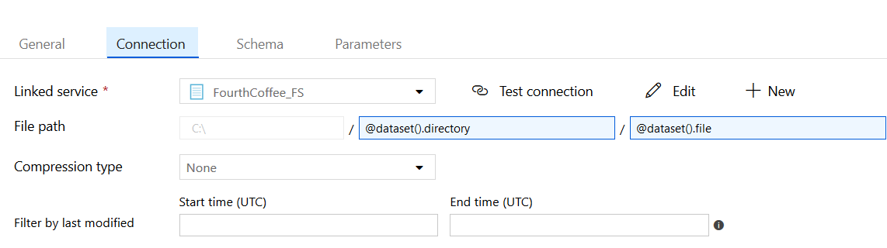

## Challenge 3: Breaking the fourth wall

This challenge focuses on incorporating additional data sources into the
data lake. While the initial data was extracted from cloud based sources,
the data from this challenge comes from on-premises data stores.

It may become apparent during this challenge that these sources use a variety of data types and formats;
handling this is for the next challenge!
For now, we will stay focused on extracting the data into the data lake, **preferably as-is**.

> NOTE: To establish an OpenHack lab environment, these “on-premises” sources are modelled
as Azure VMs. Please suspend disbelief, and imagine that these VMs are truly located
on-premises with their respective acquired fictitious companies (VanArsdel, Ltd. and Fourth Coffee).

### Extracting VanArsdel, Ltd. SQL data

The process is almost identical to the work performed to extract the data
from Southridge Video's CloudStreaming database.
The primary difference is that the SQL Server instance is "on-premises"
(for the contraints of this lab, on an Azure Virtual Machine),
rather than in Azure SQL.

Azure Data Factory supports extraction of on-premises sources
via the installation of a
[self-hosted integration runtime](https://docs.microsoft.com/en-us/azure/data-factory/create-self-hosted-integration-runtime#installation-best-practices).

Begin by adding a SQL Server dataset.


When creating the new Linked Service from the Connection
tab, choose to create a New integration runtime.


Follow the prompts to create a new Self Hosted IR.
This will involve installing the runtime and registering
via an authentication key after the installation completes.

When using the [Parquet format](https://docs.microsoft.com/en-us/azure/data-factory/supported-file-formats-and-compression-codecs#parquet-format),
it will also be required to install
the 64-bit JRE 8 (Java Runtime Environment)
or OpenJDK on your IR machine.

> NOTE: In production scenarios, the self-hosted IR
should not be installed on the database server itself.
Doing so would have security and performance implications.
Instead, a jump box would be used.
For the scope of the OpenHack, it is acceptable to install
the self-hosted IR on the provided "on-premises" VMs.

Once the runtime and linked service are established,
the remainder of the dataset and pipeline creation
is exactly the same as for the Azure SQL databases.
One could Clone the pipeline which copied the CloudStreaming data,
and would then only need to change the Source and `items` collection.

### Copying the Fourth Coffee CSV data

This is accomplished in the same way, again.
The difference is that a File System dataset is created.


Note that while it is recommended to parameterize the
directory and file name, as performed for the ADLS Gen2 sink,
temporarily specifying a single file will enable the
"Detect Text Format" feature.




Alternatively, choose the "Binary copy" checkbox.
Then create another ADLS Gen2 dataset using the existing
ADLS Gen2 linked service, but again choosing the "Binary copy".
Then use these as the Source and Sink to copy the csv
files exactly as they are.

> TODO: Attempting to publish after cloning and updating
source and `items` is giving a failure that the Copy Table
activity requires the Source Type. Had to edit the code view to update the `typeProperties` with the following:

```json
"source": {
    "type": "FileSystemSource",
    "recursive": true
},
```

### Establishing source control

Azure Data Factory supports git integration.
Another option is to more manually export and commit the ARM templates from Azure Data Factory.
