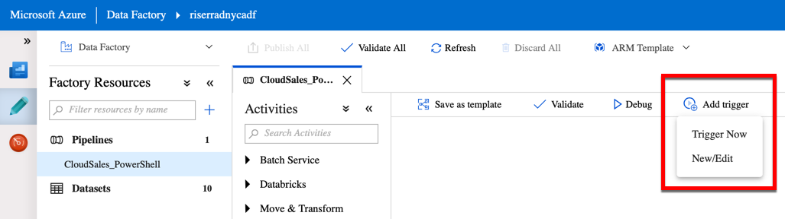

# Creating Pipelines to orchestrate the Data movement

Now that you already have the Datasets configured properly, you can now create
the Pipelines that will use them to move data from the source to the sink.

## 01 - Create the Pipeline to move the CloudSales SQL database

Using [this reference](https://docs.microsoft.com/en-us/azure/data-factory/quickstart-create-data-factory-powershell#create-a-pipeline),
you will create a pipeline using PowerShell.

Create a new file called `CloudSales-Pipeline.json` with the following structure:

```json
{
    "name": "<pipeline name>",
    "properties": {
        "activities": [
            {
                "name": "ForEach_Table",
                "type": "ForEach",
                "typeProperties": {
                    "items": {
                        "value": "@pipeline().parameters.items",
                        "type": "Expression"
                    },
                    "activities": [
                        {
                            "name": "Copy_Rows",
                            "type": "Copy",
                            "policy": {
                                "timeout": "7.00:00:00",
                                "retry": 0,
                                "retryIntervalInSeconds": 30,
                                "secureOutput": false,
                                "secureInput": false
                            },
                            "typeProperties": {
                                "source": {
                                    "type": "SqlSource"
                                },
                                "sink": {
                                    "type": "AzureBlobFSSink"
                                },
                                "enableStaging": false
                            },
                            "inputs": [
                                {
                                    "referenceName": "<source dataset name>",
                                    "type": "DatasetReference",
                                    "parameters": {
                                        "tableName": "@item().source.tableName"
                                    }
                                }
                            ],
                            "outputs": [
                                {
                                    "referenceName": "<sink dataset name>",
                                    "type": "DatasetReference",
                                    "parameters": {
                                        "tableName": "@item().destination.fileName",
                                        "filePath": "@pipeline().parameters.destinationFolder"
                                    }
                                }
                            ]
                        }
                    ]
                }
            }
        ],
        "parameters": {
            "items": {
                "type": "Array",
                "defaultValue": [
                    {
                        "source": {
                            "tableName": "[dbo].[Table1]"
                        },
                        "destination": {
                            "fileName": "Table1"
                        }
                    },
                    {
                        "source": {
                            "tableName": "[dbo].[Table2]"
                        },
                        "destination": {
                            "fileName": "Table2"
                        }
                    },
                    {
                        "source": {
                            "tableName": "[dbo].[TableN]"
                        },
                        "destination": {
                            "fileName": "TableN"
                        }
                    }
                ]
            },
            "destinationFolder": {
                "type": "String",
                "defaultValue": "<folder name>"
            }
        }
    },
    "type": "Microsoft.DataFactory/factories/pipelines"
}
```

Attention to replace the following values:

- `<pipeline name>`: a name for your pipeline
- `<source dataset name>`: the name of the source dataset
- `<sink dataset name>`: the name of the destination dataset (parquet)
- `parameters:items`: is the list of tables you will copy to the sink.
You will notice table names like `[dbo].[Table1]`. Replace it with the names
of the tables you will copy and add new ites as needed.
- `destinationFolder:defaultValue`: replace `<folder name>` with the name of
the folder you want to store the CloudSales files.
    - For example, if you want to keep all the files for this sample on the
    same `southridge` ADLS Gen2 file system, you may use
    `southridge/raw/cloudsales`

> Also about `parameters:items`, this pipeline leverages on a very important
> instruction: `ForEach`. **ForEach** is a loop instruction that will repeat one
> or more activives - in this case, the `Copy_Rows` - over every given item.
>
> For more information about the `ForEach` activity, refer to
> [this link](https://docs.microsoft.com/en-us/azure/data-factory/control-flow-for-each-activity).

Once you have the file adjusted properly, run the PowerShell commands below
to create the pipeline on Data Factory:

```powershell
$dataFactoryName = "<data factory name>"
$resourceGroupName = "<resource group name>"
$pipelineName = "<pipeline name>"

Set-AzDataFactoryV2Pipeline `
    -DataFactoryName $dataFactoryName `
    -ResourceGroupName $resourceGroupName `
    -Name $pipelineName `
    -DefinitionFile ".\CloudSales-Pipeline.json"
```

### Trigger the Pipeline execution

Once the Pipeline is created, go to
[https://adf.azure.com](https://adf.azure.com),
find the Pipeline you just created and click `Add Trigger > Trigger Now` to run it.



## 02 - Create the Pipeline to move the CloudStreaming SQL database

You can repeat the process described on stage 01 to also copy the
CloudStreaming database.

Make sure to replace all the relevant information to have the data from the
right source and also to store CloudStreaming data in a separate
structure on the sink.

You will need to pay attention to replace these values:

- `<pipeline name>`: a name for your pipeline
- `<source dataset name>`: the name of the CloudStreaming source dataset
- `parameters:items`: is the list of tables you will copy to the sink.
You will notice table names like `[dbo].[Table1]`. Replace it with the names
of the tables you will copy and add new ites as needed.
- `destinationFolder:defaultValue`: replace `<folder name>` with the name for
the folder you want to store the CloudStreaming files, usually a different
folder than the one used to store CloudSales data.
    - For example, if you want to keep all the files for this sample on the
    same `southridge` ADLS Gen2 file system, you may use
    `southridge/raw/cloudstreaming`

> You may not change the `<sink dataset name>` because you will copy data
> all to the same data lake or sink.

## 03 - Create the Pipeline to move the Movies CosmosDB data

Using the reference for creating a Pipeline found [here](https://docs.microsoft.com/en-us/azure/data-factory/quickstart-create-data-factory-powershell#create-a-pipeline),
you will create a new Pipeline to copy the data from a CosmosDB collection to
the data lake.

First, create a new JSON file called `Movies-Pipeline.json` with the following structure:

```json
{
    "name": "<pipeline name>",
    "properties": {
        "activities": [
            {
                "name": "Copy_Rows",
                "type": "Copy",
                "inputs": [
                    {
                        "referenceName": "<cosmosdb dataset name>",
                        "type": "DatasetReference"
                    }
                ],
                "outputs": [
                    {
                        "referenceName": "<sink dataset name>",
                        "type": "DatasetReference",
                        "parameters": {
                            "filePath": "@pipeline().parameters.destinationFolder",
                            "collectionName": "<file name>"
                        }
                    }
                ],
                "typeProperties": {
                    "source": {
                        "type": "DocumentDbCollectionSource",
                        "nestingSeparator": ""
                    },
                    "sink": {
                        "type": "AzureBlobFSSink"
                    }
                }
            }
        ],
        "parameters": {
            "destinationFolder": {
                "type": "String",
                "defaultValue": "<default value for destinationFolder>"
            }
        }
    }
}
```

Make sure to replace the following values:

- `<pipeline name>`: a name for your pipeline
- `<source dataset name>`: the name of the Movies source dataset
- `<sink dataset name>`: the name of the ADLS destination dataset (JSON)
- `<file name>`: the name of the file that will contain the data on
the destination folder
- `destinationFolder:defaultValue`: replace `<folder name>` with the name for
the folder you want to store the Movies file, usually a different
folder than the ones used to store other data you already copied.

One important property to understand here is:

```json
properties:activities:<copy task>:typeProperties:source:nestingSeparator
```

It needs to be `""` (blank). Otherwise, if you do not set it explicitly, it
will assume it's default value, which is a dot (`"."`).

As you are copying the data *as is*, having the `nestingSeparator` as a `"."`
will not work on this pipeline. For more information, refer to
[this documentation](https://docs.microsoft.com/en-us/azure/data-factory/connector-azure-cosmos-db#import-or-export-json-documents):

> *When you use activity authoring, don't specify the structure (also called
> schema) section in the Azure Cosmos DB dataset. Also, don't specify the
> `nestingSeparator` property in the Azure Cosmos DB source or sink in Copy
> Activity. When you import from or export to JSON files, in the corresponding
> file store dataset, specify the format type as JsonFormat and configure the
> `filePattern` as described in the JSON format section. Then, don't specify
> the structure section and skip the rest of the format settings.*

After the pipeline JSON file is configured properly, run the PowerShell
command to create the pipeline on the Data Factory:

```powershell
$dataFactoryName = "<data factory name>"
$resourceGroupName = "<resource group name>"
$pipelineName = "<pipeline name>"

Set-AzDataFactoryV2Pipeline `
    -DataFactoryName $dataFactoryName `
    -ResourceGroupName $resourceGroupName `
    -Name $pipelineName `
    -DefinitionFile ".\Movies-Pipeline.json"
```

As you have your pipeline successfully created, repeat the instructions
[above](#Trigger-the-Pipeline-execution) to find and trigger its execution.

## Additional resources

- Copy data to or from Azure Cosmos DB (SQL API) by using Azure Data Factory
    - [Copy Activity properties](https://docs.microsoft.com/en-us/azure/data-factory/connector-azure-cosmos-db#copy-activity-properties)