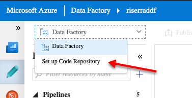
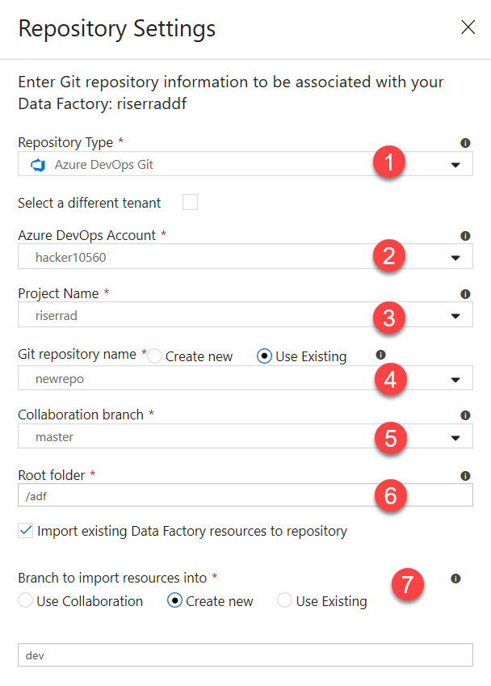
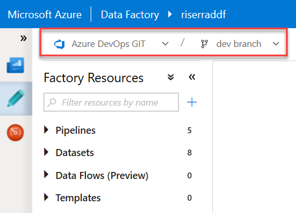
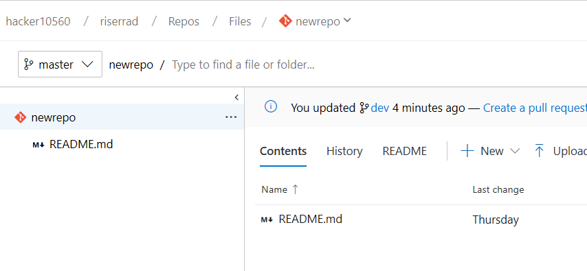
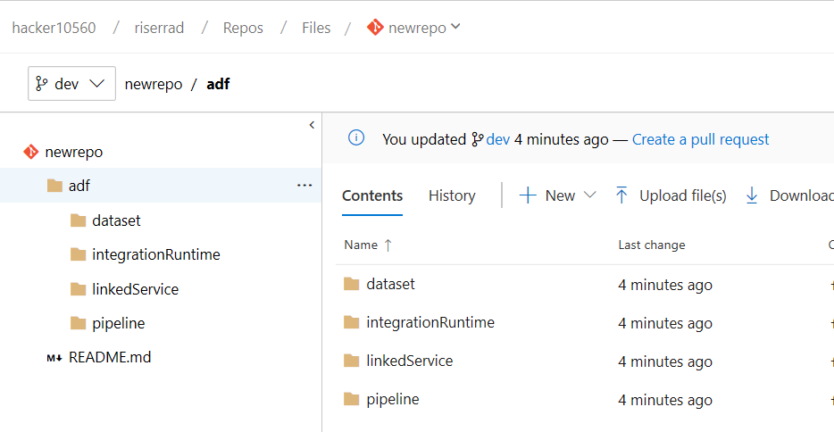

# Challenge 03 - Extracting data from on-premises sources

The goals of this challenge is to:

- Extract data from two on-premises sources:
    - A CSV data source
    - An SQL Server database
- And after you have everything set up, set up source control

## Extracting data from the two on-premises sources

Both CSVs and the SQL database are hosted on *onprem* virtual machines which, for the openhack purpose, are
all Azure Virtual Machines.

To make it possible to extract data from on-premises sources through Azure Data
Factory, we need to leverage on the
[Self-Hosted Integration Runtimes](https://docs.microsoft.com/en-us/azure/data-factory/create-self-hosted-integration-runtime).

> *The integration runtime (IR) is the compute infrastructure that Azure Data
> Factory uses to provide data-integration capabilities across different
> network environments.*

So the basic steps you will need to perform to copy data from on-premises
sources to the cloud are:

- [Create the Self-Hosted Integration Runtime for the source](challenge-03/creating-self-hosted-ir.md)
    - You will need to repeat this procedure for each Integration Runtime
    needed for this challenge (File System and On premises SQL Server)
    - Install and configure the IR on the on-premises virtual machine
- Create the Linked Service which will use this Integration Runtime
    - [File System Linked Service](challenge-03/creating-file-system-linked-service.md)
    - [On-premises SQL Server Linked Service](challenge-03/creating-onprem-sql-server-linked-service.md)
- Create the Dataset
    - [Dataset for File System sources](challenge-03/creating-file-system-dataset.md)
        - For the sink dataset for this File System, you may create a
        **[Binary Dataset](challenge-03/creating-sink-binary-dataset.md)**
        to copy the files *as is*, as the on-premises Machine may not
        have the necessary
        [requirements](https://docs.microsoft.com/en-us/azure/data-factory/supported-file-formats-and-compression-codecs#parquet-format)
        to generate parquet files.
    - [Dataset for on-premises SQL Server](challenge-03/creating-onprem-sql-server-dataset.md)
        - For the sink dataset for this on-prem SQL Server, you may use the
        **JSON** sink dataset you created for copying the Movies catalog. This
        is because the on-premises Machine may not have the necessary
        [requirements]([requirements](https://docs.microsoft.com/en-us/azure/data-factory/supported-file-formats-and-compression-codecs#parquet-format))
        to generate parquet files.
- Create the Pipeline
    - [Pipeline for on-premises SQL Server](challenge-03/creating-onprem-sql-server-pipeline.md)
    - [Pipeline for File System sources](challenge-03/creating-file-system-pipeline.md)

## Establishing source control

Azure Data Factory supports Git integration from its UI. This integration
supports either GitHub or Azure DevOps.

### Setting up Azure DevOps integration

> If you were just assigned permissions to use the Team Project/repository,
> make sure to have accessed it at least once from the web UI and
> accepted the terms before configuring this integration.

- Go to your Azure DevOps account and create either a new Team Project
or a new repository inside an existing Team Project.
- Initialize this new repository either with a
`.gitignore` or a `README.me` file.
- Grab the clone URL for this repository and go back to Azure Data Factory.
    - For example:
    `https://johndoe@dev.azure.com/myazdoinstance/myteamproject/_git/myrepository`, where:
        - `johndoe` is your username
        - `myazdoinstance` is the Azure DevOps organization name
        - `myteamproject` is the Team Project name
        - `myrepository` is the repository name
    - If you grab the URL from the Azure DevOps UI, this URL will be ready for you
- Back on Azure Data Factory, on the top left drop down button, select
`Set up Code Repository`

- On the **Repository Settings** box that appear on the right:

1. Select `Azure DevOps`
2. Select your `Azure DevOps account`
3. Select the `Team Project`
4. Select if you will use either a **new** or an **existing** Git repo
5. Select the `Collaboration branch`
    - **Collaboration branches** are useful to let Data Factory know from
    which branch you want it to publish the objects from. If you have
    objects saved to any other branch, it will not use it.
6. Set the `Root folder`, which is where all the code for Data Factory
objects will be saved to, within the Git repository
7. As you already have Data Factory objects (Linked Services, Datasets, etc)
configured, you will likely want to import their code to source control.
To do so, select `Import existing Data Factory resources to repository`.
    - On `Branch to import resources into`, select either to
        - Import directly to the `Collaboration` branch
        - `Create new` branch and import resources into (recommended)
            - If you create a new, make sure to give it a name
        - `Use existing` if you already have a branch to do it

After you save it, it will ask you which branch you want to work with.
Select the branch you just created to see it in action:

If you switch to Azure DevOps, you will see that the `master` branch
remains untouched:

But you will also notice that the branch you created (for this guidance's
purpose, the `dev` branch) will have all the files under the `/adf` directory:

## Learning experiences and road blocks

## Potential feedbacks

- Every time we use the file editor on Azure Cloud Shell, the command line
stops working. We need to reload the entire page to make it work again.
The downside is that, if you had set any variable values, you will loose it.
- The PowerShell command lines for DataFactory could have a `-Validate` modifier
so the Linked Service/DataSet/Pipeline file could be validated before created
on DataFactory.
    - Today, the only way to do it is by submitting it for creation and, if it
    fails, it provides a good error message but, if it succeeds, it creates the
    resource on Data Factory. What if I only want
    to validate but not create yet
- If you already have a machine with a Self-Hosted IR configured and you want
to reconfigure it to connect to a different IR, there's no doc to guide you
through. That's why I created the following issue:
    - [Need to explain how to reconfigure a Self-Hosted IR installation](https://github.com/MicrosoftDocs/azure-docs/issues/29819)
- Data Factory stores the credentials as `encryptedCredential` on the JSON file
it generates automatically. It would be good if there was docs teaching how
to generate it so people creating datasets using JSON files would store it
correctly instead of creating files with raw credentials and being Data Factory
the one responsible for converting it.
- Regarding the Az module and Data Factory V2 functions, there must be a
pattern on how to name resources:
    - For creating Linked Services, dashes (`-`) are allowed
    - For creating Datasets, only underscores (`_`) are allowed
    - For creating Self-Hosted Integration Runtimes, only dashes (`-`)
    are allowed (`^[A-Za-z0-9]+(?:-[A-Za-z0-9]+)*$`)
- Sometimes, when configuring code repository on ADF, after you select
`Azure DevOps` and it starts loading the organizations, it starts
blinking on a page reload loop. After that, you cannot access
Data Factory anymore.

### Self-Hosted IR

- While creating a Linked Service for a File System IR, one of the properties
is `properties:typeProperties:host`. At first sight, it seems to be the
machine's hostname, but it acually is the folder you want to share.
It would be nice if we could rename this property.