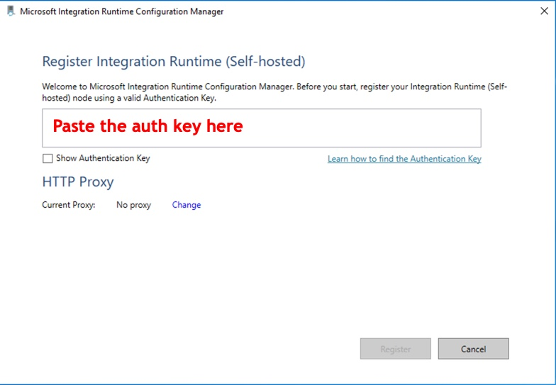

# Creating the Self-Hosted Integration Runtime

## 01 - Creating the Self-Hosted Integration Runtime reference on Data Factory

Use the PowerShell command below to create the IR reference on Data Factory:

```powershell
$dataFactoryName = "<data factory name>"
$resourceGroupName = "<resource group name>"
$selfHostedIntegrationRuntimeName = "<pipeline name>"
$selfHostedIntegrationRuntimeDescription = "<self-hosted IR description>"

Set-AzDataFactoryV2IntegrationRuntime `
    -ResourceGroupName $resourceGroupName `
    -DataFactoryName $dataFactoryName `
    -Name $selfHostedIntegrationRuntimeName `
    -Type SelfHosted `
    -Description $selfHostedIntegrationRuntimeDescription
```

## 02 - Retrieve the Self-Hosted IR authentication key

You will need this key to install and register the Self-Hosted IR agent
on the virtual machine. To do so, run the following command using PowerShell:

```powershell
Get-AzDataFactoryV2IntegrationRuntimeKey `
    -ResourceGroupName $resourceGroupName `
    -DataFactoryName $dataFactoryName `
    -Name $selfHostedIntegrationRuntimeName
```

You will have an output similar to this:

```powershell
AuthKey1    AuthKey2
--------    --------
<authkey1>  <authkey2>
```

Take note of one of these keys to use later on the virtual machine.

## 03 - Download, install and register the Self-Hosted IR on the virtual machine

Once you have created the IR and have the authentication key, you can download
the installer to the virtual machine and start installing it. Follow
[this link](https://www.microsoft.com/en-us/download/details.aspx?id=39717)
to go to the download page.

After it is properly installed, it will automatically open a window like below:



Paste the auth key on the highlighted spot and click *Register*.
It will validate the registration parameters. Once you get the success message, hit *Finish*.

Wait until the registration is finished and then click on *Launch Configuration
Manager* view the Self-Hosted IR *control pane*. If you see *"Connected to the
cloud service (Data Factory V2)"* on the status bar, your Self-Hosted IR
is successfully installed and configured.