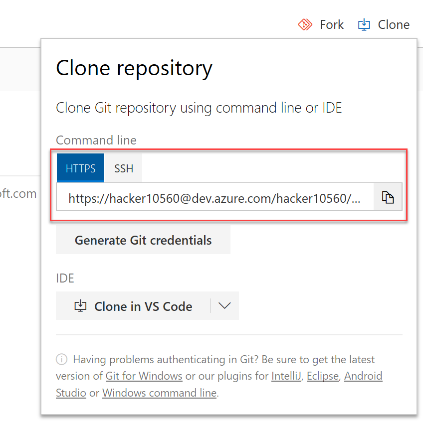

# Adding the Databricks Notebooks to source control

Once you configured the branch policy on your Azure DevOps Git repo, you use
it to version each of the notebooks you create. To do so, follow
[this reference](https://docs.azuredatabricks.net/user-guide/notebooks/azure-devops-services-version-control.html)
and add each of your notebooks to a repository sub folder (e.g., `/notebooks`) on the
development branch.

- On Azure DevOps, from the repository view, click on the `Clone` button on
the top right of the screen. You will see something like this:

- Go back to Databricks and open the Notebook you want to add to source control.
- Click on `Revision history` on the top right of the page

- Click on `Git: Not linked

- On this new screen:
    1. Select `Link`
    2. Paste the Git Clone URL you've got from Azure DevOps
    3. Select the `dev` branch you created previously. If you can't select
    it, type `dev` and then click on `Create new dev branch`
    4. Simplify the suggested `Path in Git repo` to something like
    `notebooks/<notebook name>.py`
    5. Click `Save`

After you perform these steps, it will ask you to comment the commit.
Do it and then click `Save`.

Every time you want to commit the changes you made to a notebook, click
on `Revision history` and then on `Save now` on the latest update on the
list.